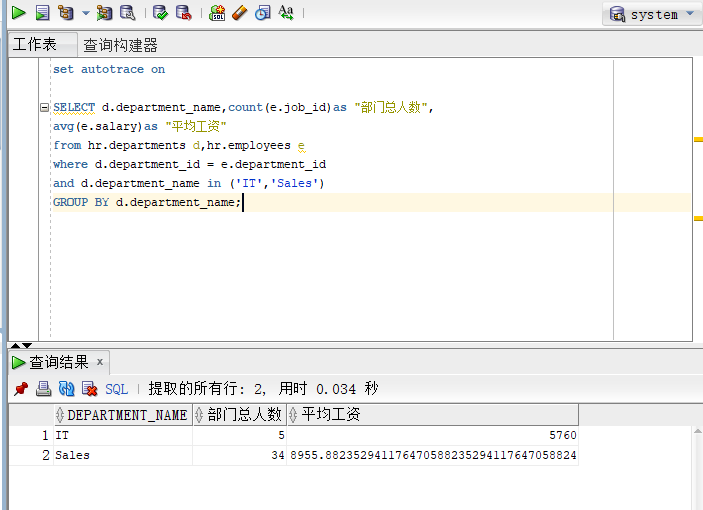
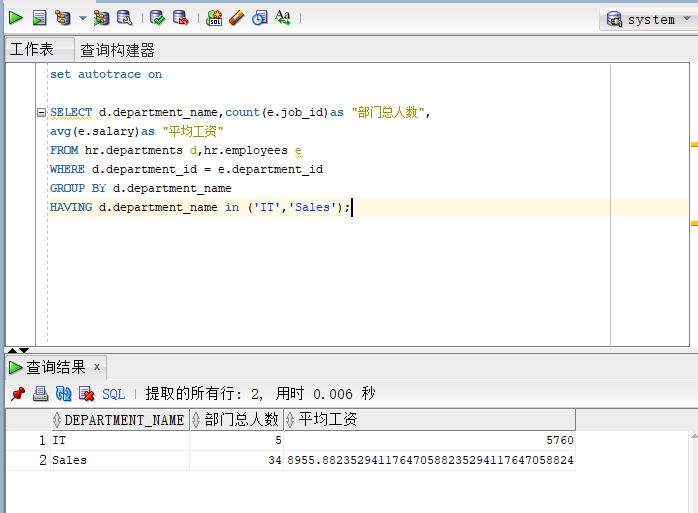
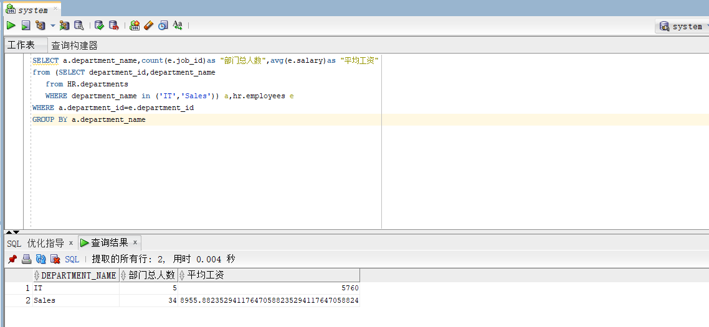

# 实验一：SQL语句的执行计划分析与优化指导

## 实验目的：

分析SQL执行计划，执行SQL语句的优化指导。理解分析SQL语句的执行计划的重要作用。

## 实验内容：

·对Oracle12c中的HR人力资源管理系统中的表进行查询与分析。
 ·首先运行和分析教材中的样例：本训练任务目的是查询两个部门('IT'和'Sales')的部门总人数和平均工资，以下两个查询的结果是一样的。但效率不相同。
· 设计自己的查询语句，并作相应的分析，查询语句不能太简单。

### 教材中的查询语句

- 查询1：

```
set autotrace on

SELECT d.department_name,count(e.job_id)as "部门总人数",
avg(e.salary)as "平均工资"
from hr.departments d,hr.employees e
where d.department_id = e.department_id
and d.department_name in ('IT','Sales')
GROUP BY d.department_name;
```

- 查询2

```
set autotrace on

SELECT d.department_name,count(e.job_id)as "部门总人数",
avg(e.salary)as "平均工资"
FROM hr.departments d,hr.employees e
WHERE d.department_id = e.department_id
GROUP BY d.department_name
HAVING d.department_name in ('IT','Sales');
```

执行上面两个比较复杂的返回相同查询结果数据集的SQL语句，通过分析SQL语句各自的执行计划，判断哪个SQL语句是最优的。最后将你认为最优的SQL语句通过sqldeveloper的优化指导工具进行优化指导，看看该工具有没有给出优化建议

### 语句执行结果：

- 查询一



- 查询二：



### 查询结果分析

经过分析后我认为查询1的sql语句更优，查询1的sql语句在效率上更高，查询速度比较快。查询2先执行的是group接着才是having语句，而查询1先执行的是having语句，相较于查询2拥有更快的速度和更高的效率。

执行sqldeveloper的优化知道，给出了以下建议：


### 设计查询语句：

SELECT a.department_name,count(e.job_id)as "部门总人数",avg(e.salary)as "平均工资"
from (SELECT department_id,department_name
   from HR.departments
   WHERE department_name in ('IT','Sales')) a,hr.employees e
WHERE a.department_id=e.department_id
GROUP BY a.department_name

### 查询结果：



### 查询语句分析：

分析样例语句后，我使用嵌套查询设计了自己的查询语句。我采用两个from和两个where进行嵌套查询，最后执行group进行分组，得到了想要的结果。但还是不如样例给出的查询1的sql语句，和其相比效率上要低一些。

## 实验总结

​	通过本次实验，我收获了很多，一方面学习了sqldeveloper这个工具的使用，另一方面通过自己动手执行样例查询语句。通过自己对样例查询的分析和sqldeveloper工具的sql优化指导功，我发现不同的查询语句在执行效率上是会有差距的，不同的语句执行效率可能会千差万别这。也就意味着语句写的不好，查询速度就会比较慢。最后，我总结分析了样例语句后设计了自己的查询语句，比较后发现还是样例的查询1更好。