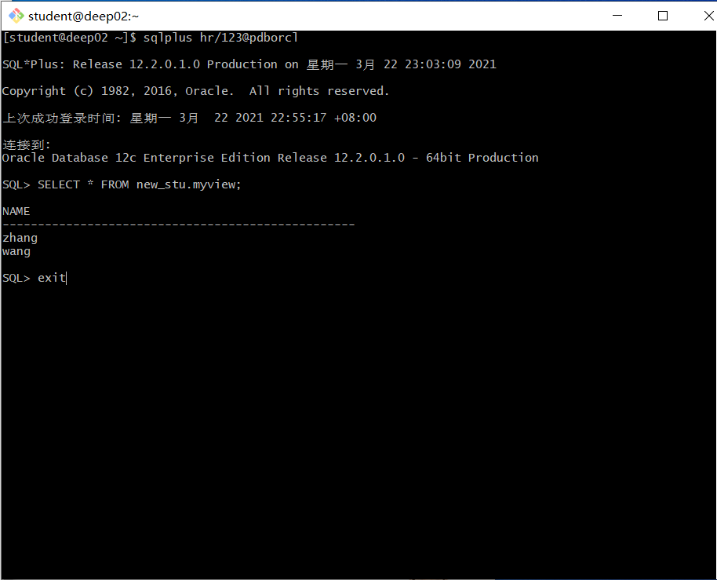

# 实验2：用户及权限管理

#### **用户名：**future-builder

## 实验目的

掌握用户管理、角色管理、权根维护与分配的能力，掌握用户之间共享对象的操作技能。

## 实验内容

Oracle有一个开发者角色resource，可以创建表、过程、触发器等对象，但是不能创建视图。本训练要求：

- 在pdborcl插接式数据中创建一个新的本地角色con_res_view，该角色包含connect和resource角色，同时也包含CREATE VIEW权限，这样任何拥有con_res_view的用户就同时拥有这三种权限。
- 创建角色之后，再创建用户new_user，给用户分配表空间，设置限额为50M，授予con_res_view角色。
- 最后测试：用新用户new_user连接数据库、创建表，插入数据，创建视图，查询表和视图的数据。

### 实验步骤

- 第1步：以system登录到pdborcl，创建角色stu_mayong和用户new_stu，并授权和分配空间：

```sql
$ sqlplus system/123@pdborcl
SQL> CREATE ROLE stu_mayong;
角色已创建。
SQL> GRANT connect,resource,CREATE VIEW TO stu_mayong;
授权成功。
SQL> CREATE USER new_stu IDENTIFIED BY 123 DEFAULT TABLESPACE users TEMPORARY TABLESPACE temp;
用户已创建。
SQL> ALTER USER new_stu QUOTA 50M ON users;
用户已更改。
SQL> GRANT stu_mayong TO new_stu;
授权成功。
SQL> exit
```

语句“ALTER USER new_user QUOTA 50M ON users;”是指授权new_user用户访问users表空间，空间限额是50M。


- 第2步：新用户new_stu连接到pdborcl，创建表mytable和视图myview，插入数据，最后将myview的SELECT对象权限授予hr用户。

```
$ sqlplus new_stu/123@pdborcl
SQL> show user;
USER is "NEW_USER"
SQL> CREATE TABLE mytable (id number,name varchar(50));
Table created.
SQL> INSERT INTO mytable(id,name)VALUES(1,'zhang');
1 row created.
SQL> INSERT INTO mytable(id,name)VALUES (2,'wang');
1 row created.
SQL> CREATE VIEW myview AS SELECT name FROM mytable;
View created.
SQL> SELECT * FROM myview;
NAME
--------------------------------------------------
zhang
wang
SQL> GRANT SELECT ON myview TO hr;
Grant succeeded.
SQL>exit
```


- 第3步：用户hr连接到pdborcl，查询new_stu授予它的视图myview

```
$ sqlplus hr/123@pdborcl
SQL> SELECT * FROM new_stu.myview;
NAME
--------------------------------------------------
zhang
wang
SQL> exit
```



## 查看数据库的使用情况

以下样例查看表空间的数据库文件，以及每个文件的磁盘占用情况。

```
$ sqlplus system/123@pdborcl

SQL>SELECT tablespace_name,FILE_NAME,BYTES/1024/1024 MB,MAXBYTES/1024/1024 MAX_MB,autoextensible FROM dba_data_files  WHERE  tablespace_name='USERS';

SQL>SELECT a.tablespace_name "表空间名",Total/1024/1024 "大小MB",
 free/1024/1024 "剩余MB",( total - free )/1024/1024 "使用MB",
 Round(( total - free )/ total,4)* 100 "使用率%"
 from (SELECT tablespace_name,Sum(bytes)free
        FROM   dba_free_space group  BY tablespace_name)a,
       (SELECT tablespace_name,Sum(bytes)total FROM dba_data_files
        group  BY tablespace_name)b
 where  a.tablespace_name = b.tablespace_name;
```


- autoextensible是显示表空间中的数据文件是否自动增加。
- MAX_MB是指数据文件的最大容量。

### 实验总结

​	通过本次实验，我收获了很多，本次实验是Oracle数据库关于用户管理、角色管理、权根维护与分配相关知识，要求我们掌握用户之间共享对象的操作技能。首先是角色的创建和对角色的授权和分配空间，创建角色使用__CREATE ROLE__命令，分配空间使用 **ALTER...ON..**命令，然后使用Grant命令授予权限。用户创建视图后，可以进行数据的共享，使用命令**GRANT SELECT ON viewname TO username**将viewname的SELECT对象权限授予username用户。这时该用户即可登录查询授予给他的视图viewname。最后，我们可以通过sql命令来查看数据库的使用情况，例如查看表空间的数据库文件，以及每个文件的磁盘占用情况等。