##   基于Oracle的学生成绩管理的数据库设计 

##### 	姓名：马勇 	学号201811606228

#### 1、创建角色role_1和用户user_1，并授权和分配空间

```sql
--创建角色role_1和用户user_1，并授权和分配空间
create role c##role_1;
grant connect, resource, create view to c##role_1;
create user c##user_1 identified by 123 default tablespace users temporary tablespace temp;
alter user c##user_1 quota 50m on users;
```

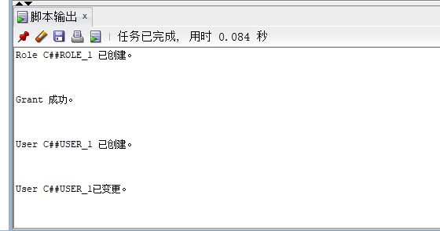

#### 2、创建角色role_2和用户user_2，并授权和分配空间

```sql
--创建角色role_2和用户user_2，并授权和分配空间
create role c##role_2;
grant connect, resource, create view to c##role_2;
create user c##user_2 identified by 123 default tablespace users temporary tablespace temp;
alter user c##user_2 quota 50m on users;
```


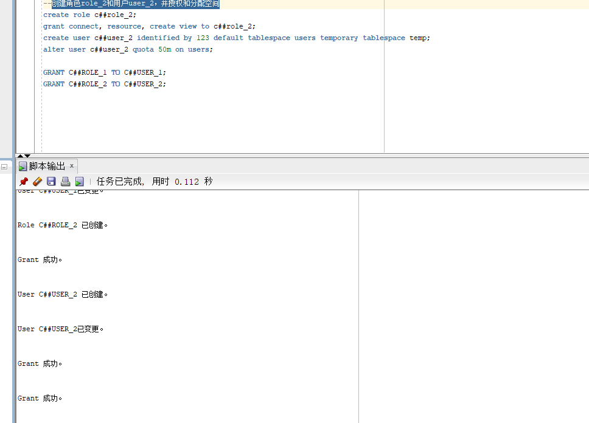

#### 3、创建表

```sql
--创建用户表
create table user_(name varchar(50) primary key,passwd varchar(50) not null);
--创建院系表
create table cs(
cs_class varchar(50) primary key,
cs_dept varchar(50) not null,
cs_grade varchar(50) not null
);
--创建学生表
create table student(
stu_no varchar(15) primary key,
stu_name varchar(10) not null,
stu_sex varchar(4) not null check (stu_sex='男'or stu_sex='女'), 
stu_birthday varchar(50) ,
stu_phone varchar(50),
stu_cs_class varchar(50),
constraint class_fk foreign key(stu_cs_class)  references cs(cs_class)
on delete cascade
);
--创建科目表
create table sub(
sub_subject varchar(50) primary key,
sub_teacher_name varchar(10)
);
--创建成绩表
create table gd(
gd_stu_no varchar(15),
gd_sub_subject varchar(50),
gd_grade number(3) not null,
primary key(gd_stu_no,gd_sub_subject),
constraint fk_gd_stu_no foreign key(gd_stu_no)  references student(stu_no),
constraint fk_gd_sub_subject foreign key(gd_sub_subject)  references sub(sub_subject)
);


```


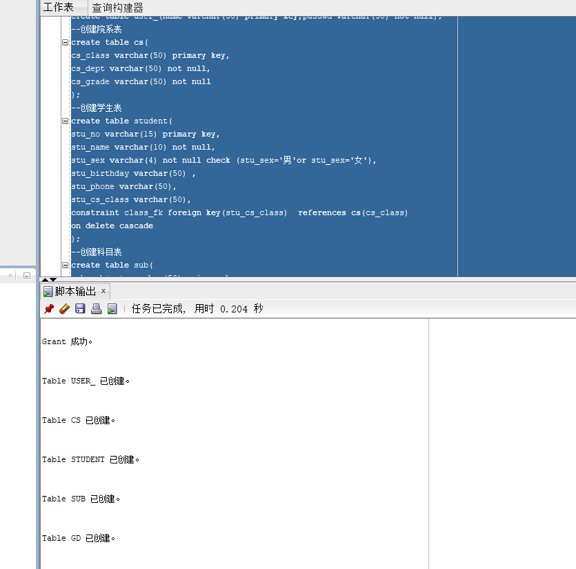

#### 4 、创建存储过程

```sql
--存储过程
create or replace procedure p_insert_stu(
p_stu_no in student.stu_no%type,
p_stu_name in student.stu_name%type,
p_stu_sex in student.stu_sex%type,
p_stu_birthday in student.stu_birthday%type,
p_stu_phone in student.stu_phone%type,
p_stu_cs_class in student.stu_cs_class%type,
s_state_values out number
) as
begin	
	 insert into student	(stu_no,stu_name,stu_sex ,stu_birthday,stu_phone,stu_cs_class)
	 values (p_stu_no,p_stu_name,p_stu_sex,p_stu_birthday,p_stu_phone,p_stu_cs_class);
if sql%rowcount=1
then s_state_values:=0;
end if;
exception

		when others then s_state_values:=1;
commit;
end;

create or replace procedure c_insert_stu(
c_stu_no in student.stu_no%type,
c_state_values out number)
as
begin
select count(*) into c_state_values from student
where stu_no=c_stu_no;
end;

create or replace procedure c_insert_stu_fk(
c_cs_class in cs.cs_class%type,
c_state_values_fk out number)
as
begin
select count(*) into c_state_values_fk from cs
where cs_class=c_cs_class;
end ;


create or replace procedure p_insert_cs(
p_cs_dept in cs.cs_dept%type,
p_cs_grade in cs.cs_grade%type,
p_cs_class in cs.cs_class%type,
s_state_values out number)
as
begin
insert into cs(cs_dept,cs_grade,cs_class)
values(p_cs_dept, p_cs_grade, p_cs_class);
if sql%rowcount=1
then s_state_values:=0;
end if;
exception
	when others then s_state_values:=1;
commit;
end ;


create or replace procedure c_insert_cs(
c_cs_class in cs.cs_class%type,
c_state_values out number)
as
begin
select count(*) into c_state_values from cs
where cs_class=c_cs_class;
end ;

create or replace procedure p_insert_sub(
p_sub_subject in sub.sub_subject%type,
p_sub_teacher_name in sub.sub_teacher_name%type,
s_state_values out number)
as
begin
insert into sub(sub_subject,sub_teacher_name)
values(p_sub_subject, p_sub_teacher_name);
if sql%rowcount=1
then s_state_values:=0;
end if;
exception
	when others then s_state_values:=1;
commit;
end;


create or replace procedure c_insert_sub(
c_sub_subject in sub.sub_subject%type,
c_state_values out number)
as
begin
select count(*) into c_state_values from sub
where sub_subject=c_sub_subject;
end ;


create or replace procedure p_insert_gd(
p_gd_stu_no in gd.gd_stu_no%type,
p_gd_sub_subject in gd.gd_sub_subject%type,
p_gd_grade in gd.gd_grade%type,
s_state_values out number)
as
begin
insert into gd(gd_stu_no,gd_sub_subject,gd_grade)
values(p_gd_stu_no,p_gd_sub_subject,p_gd_grade);
if sql%rowcount=1
then s_state_values:=0;
end if;
exception
	when others then s_state_values:=1;
if p_gd_grade=null
then s_state_values:=2;
end if;
commit;
end ;


create or replace procedure c_insert_gd(
p_gd_stu_no in gd.gd_stu_no%type,
p_gd_sub_subject in gd.gd_sub_subject%type,
c_state_values out number)
as
begin
select count(*) into c_state_values from (
select gd_stu_no from gd
where gd_sub_subject=p_gd_sub_subject
)
where gd_stu_no=p_gd_stu_no;
end ;

create or replace procedure c_insert_gd_fk1(
c_stu_no in student.stu_no%type,
c_state_values_fk1 out number)
as
begin
select count(*) into c_state_values_fk1 from student
where stu_no=c_stu_no;
end ;

create or replace procedure c_insert_gd_fk2(
c_sub_subject in sub.sub_subject%type,
c_state_values_fk2 out number)
as
begin
select count(*) into c_state_values_fk2 from sub
where sub_subject=c_sub_subject;
end ;

create or replace procedure p_select_stu_no_info(
p_stu_no in out student.stu_no%type,
p_stu_name out student.stu_name%type,
p_stu_sex out student.stu_sex%type,
p_stu_birthday out student.stu_birthday%type,
p_stu_phone out student.stu_phone%type,
p_stu_cs_class out student.stu_cs_class%type,
p_cs_dept out cs.cs_dept%type,
p_cs_grade out cs.cs_grade%type,
c_state_values out number)
as
begin
c_state_values:=0;
select stu_no, stu_name,stu_sex ,stu_birthday ,stu_phone ,stu_cs_class ,cs_dept ,cs_grade 
 into p_stu_no, p_stu_name, p_stu_sex, p_stu_birthday, p_stu_phone, p_stu_cs_class, p_cs_dept, p_cs_grade
from student, cs
where stu_cs_class=cs_class and stu_no=p_stu_no;
exception
when NO_DATA_FOUND then c_state_values:=1;
when others then c_state_values:=2;
end ;

create or replace procedure p_select_stu_no_gd(p_stu_no in student.stu_no%type , cursor_gd out sys_refcursor)
as
begin
open cursor_gd for
select gd_sub_subject,gd_grade
from gd
where gd_stu_no=p_stu_no;
end;

create or replace procedure p_select_stu_name(
p_stu_name in student.stu_name%type ,
 cursor_stu out sys_refcursor,
c_state_values out number)
as
begin
c_state_values:=0;
open cursor_stu for
select stu_no, stu_name,stu_sex ,stu_birthday ,stu_phone ,stu_cs_class ,cs_dept ,cs_grade 
from student, cs
where stu_name=p_stu_name and stu_cs_class=cs_class;
exception
when others then c_state_values:=2;
end;

create or replace procedure p_pm_sum(
cursor_gd_sum out sys_refcursor
)
as
begin
open cursor_gd_sum for
select distinct sno,stu_name,sum
from student,(select gd_stu_no as sno,sum(gd_grade) as sum 
from gd 
group by gd_stu_no
)
where stu_no=sno
order by sum desc;
end;

create or replace procedure p_pm_sub(
p_gd_sub_subject in gd.gd_sub_subject%type,
cursor_gd_sub out sys_refcursor
)
as
begin
open cursor_gd_sub for
select gd_stu_no,stu_name,gd_grade
from gd,student
where gd_sub_subject=p_gd_sub_subject and stu_no=gd_stu_no
order by gd_grade desc;
end;

create or replace procedure p_pm_class(
p_stu_cs_class in student.stu_cs_class%type,
cursor_gd_class out sys_refcursor
)
as
begin
open cursor_gd_class for
select distinct sno,stu_name,sum
from student,(select gd_stu_no as sno,sum(gd_grade) as sum 
from gd 
group by gd_stu_no
)
where stu_no=sno and stu_cs_class=p_stu_cs_class
order by sum desc;
end;

create or replace procedure p_fx(
cursor_fx out sys_refcursor
)
as
begin
open cursor_fx for
select gd_sub_subject,max(gd_grade) as zuigao,min(gd_grade) as zuidi,avg(gd_grade) as pingjun,SUM(CASE WHEN gd_grade>=60 THEN 1 ELSE 0 END)/COUNT(*)*100 AS jigelv,
SUM(CASE WHEN gd_grade>=80 THEN 1 ELSE 0 END)/COUNT(*)*100 AS youxiulv
from gd
group by gd_sub_subject;
end;


create or replace procedure p_bujige(
cursor_bujige out sys_refcursor
)
as
begin
open cursor_bujige for
select gd_stu_no,gd_sub_subject,gd_grade
from gd
where gd_grade<60;
end;

create or replace procedure p_update_stu(
p_stu_no in student.stu_no%type,
p_stu_name in student.stu_name%type,
p_stu_sex in student.stu_sex%type,
p_stu_birthday in student.stu_birthday%type,
p_stu_phone in student.stu_phone%type,
p_stu_cs_class in student.stu_cs_class%type,
s_state_values out number
) as
begin	
update student	
set stu_name=p_stu_name,stu_sex=p_stu_sex,stu_birthday=p_stu_birthday,stu_phone=p_stu_phone,stu_cs_class=p_stu_cs_class
where stu_no=p_stu_no;	 
if sql%rowcount=1
then s_state_values:=0;
end if;
exception
	when others then s_state_values:=1;
commit;
end ;

create or replace procedure p_delete_stu(
p_stu_no in student.stu_no%type,
s_state_values out number)
as
begin
delete from gd where gd_stu_no=p_stu_no;
delete from student where stu_no=p_stu_no;
s_state_values:=0;
exception
	when others then s_state_values:=1;rollback;
commit;
end;

create or replace procedure p_update_gd(
p_gd_stu_no in gd.gd_stu_no%type,
p_gd_sub_subject in gd.gd_sub_subject%type,
p_gd_grade in gd.gd_grade%type,
s_state_values out number)
as
begin
update gd 
set gd_stu_no=p_gd_stu_no,gd_sub_subject=p_gd_sub_subject,gd_grade=p_gd_grade
where gd_stu_no=p_gd_stu_no and gd_sub_subject=p_gd_sub_subject;
if sql%rowcount=1
then s_state_values:=0;
end if;
exception
	when others then s_state_values:=1;rollback;
commit;
end ;

create or replace procedure p_delete_gd(
p_gd_stu_no in gd.gd_stu_no%type,
p_gd_sub_subject in gd.gd_sub_subject%type,
s_state_values out number)
as
begin
delete from gd
where gd_stu_no=p_gd_stu_no and gd_sub_subject=p_gd_sub_subject;
if sql%rowcount=1
then s_state_values:=0;
end if;
exception
	when others then s_state_values:=1;rollback;
commit;
end ;

create or replace procedure p_denglu(
p_name in user_.name%type,
p_passwd in user_.passwd%type,
s_state_values out number
)
as
begin
select count(*) into s_state_values
from user_
where name=p_name and passwd=p_passwd;
end;

create or replace procedure p_update_passwd(
p_name in user_.name%type,
p_passwd in user_.passwd%type,
s_state_values out number
)
as
begin
update user_ 
set passwd= p_passwd
where name=p_name;
if sql%rowcount=1
then s_state_values:=0;
end if;
exception
	when others then s_state_values:=1;rollback;
commit;
end;

create or replace procedure p_select_no(
cursor_stu_no out sys_refcursor
)
as
begin
open cursor_stu_no for
select stu_no 
from student
order by stu_no;
end;

create or replace procedure p_select_all(
cursor_all out sys_refcursor
)
as
begin
open cursor_all for
select stu_no, stu_name,stu_sex ,stu_birthday ,stu_phone ,stu_cs_class ,cs_dept ,cs_grade 
from student, cs
where stu_cs_class=cs_class
order by stu_no;
end;

create or replace procedure p_select_count(
myrowcount out number 
)
as
begin
select count(*) into myrowcount
from student;
end;
```


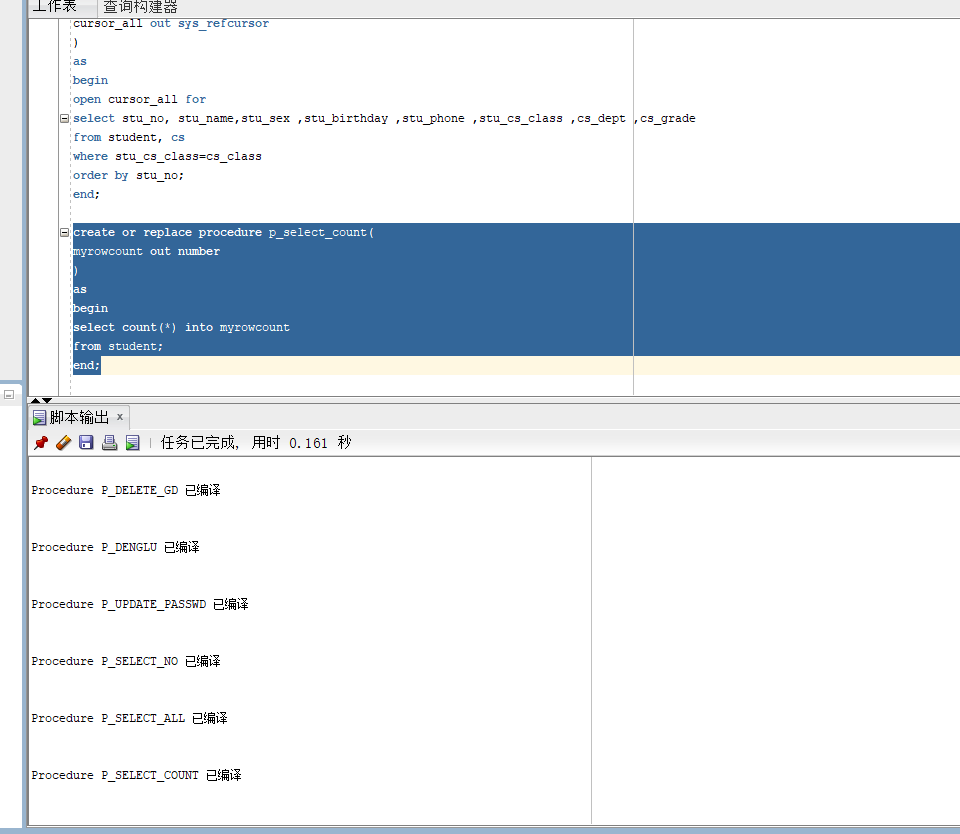

#### 5、插入数据

```sql
--插入数据
DECLARE
    maxnumber   CONSTANT NUMBER := 100;
    i           NUMBER := 1;
BEGIN
    FOR i IN 1..maxnumber LOOP
        INSERT INTO cs ( cs_class,cs_dept,cs_grade ) VALUES (
            concat('class_',i),
            concat('dept_',i),
            concat('grade_',i)
        ); 
    END LOOP;

    dbms_output.put_line(' 成功录入数据！ ');
    COMMIT;
END;
select * from cs;
```

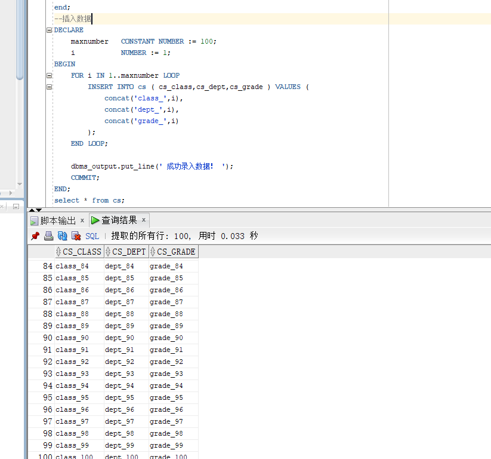

```sql
DECLARE
    maxnumber   CONSTANT NUMBER := 10000;
    i           NUMBER := 1;
    teacher_name NUMBER := 1;
BEGIN
    FOR i IN 1..maxnumber LOOP
    if mod(i,20)=0 then teacher_name:=teacher_name+1;
    end if;
        INSERT INTO sub ( sub_subject,sub_teacher_name ) VALUES (
            CONCAT('sub_subject',i),
            concat('tname',teacher_name)
        );

    END LOOP;
    
    dbms_output.put_line(' 成功录入数据！ ');
    COMMIT;
END;
```

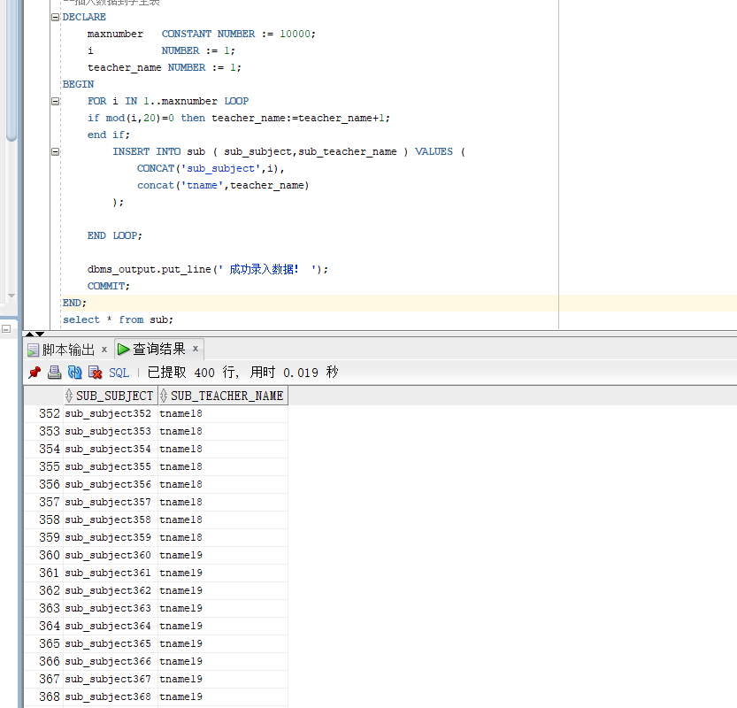

#### 6、全数据库备份

##### 6.1开始备份

```bash
$ cat rman_level0.sh
```

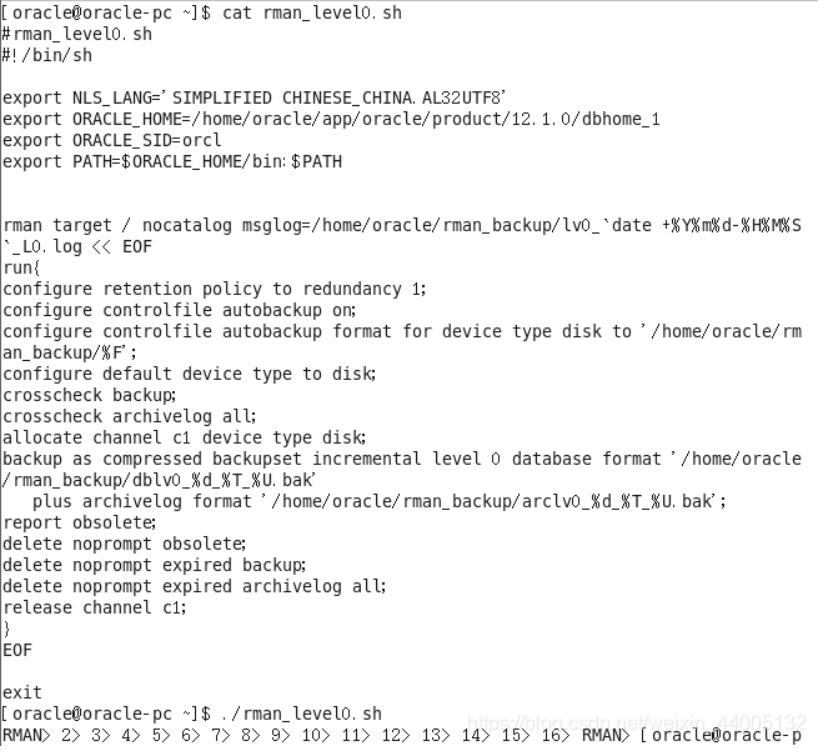

##### 6.2查看备份文件内容

```bash
$ rman target /
```

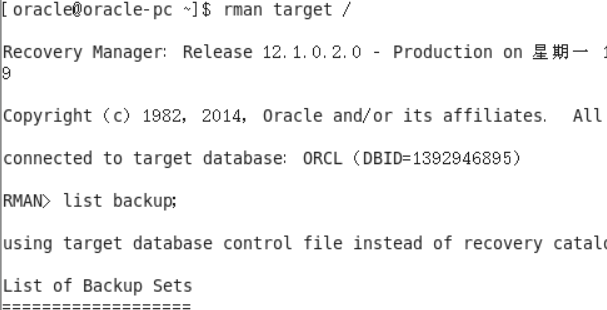

##### 6.3备份后修改数据

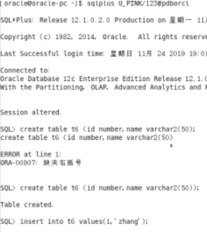

##### 6.4删除数据库文件，模拟数据库文件损坏

```bash
$ rm /home/oracle/app/oracle/oradata/orcl/pdborcl/pdbtest_U123_1.dbf
```


##### 6.5删除数据库文件后修改数据

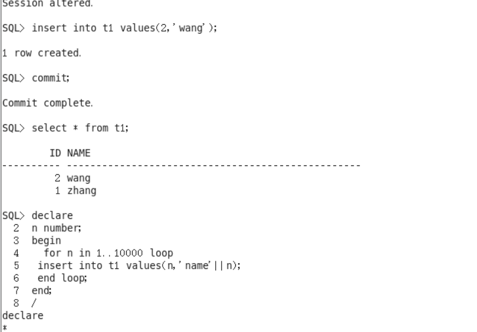

##### 6.6数据库完全恢复

- 重启损坏的数据库到mount状态

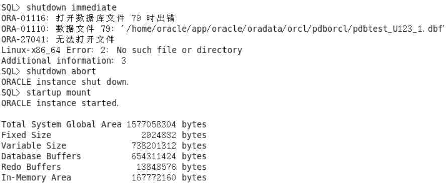

- 开始恢复数据库

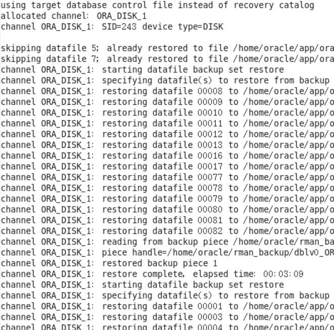

- 设计容灾方法，使用两台主机，通过DataGuard实现数据库整体的异地备份

  1. 备库

     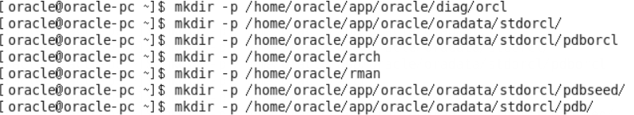

  2. 删除原有数据库

     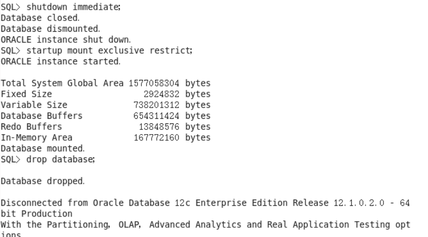

  3. 启动到nomount7

     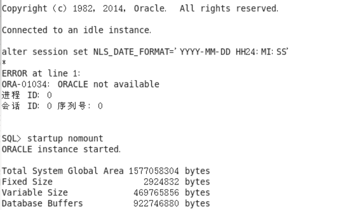

  4. 主库

     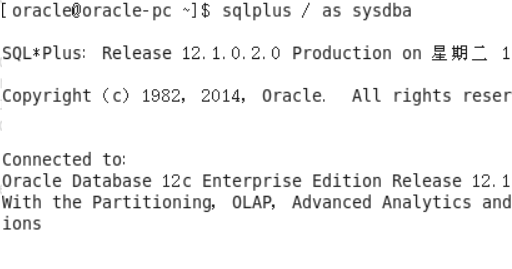

  5. 主库环境开启强制归档

     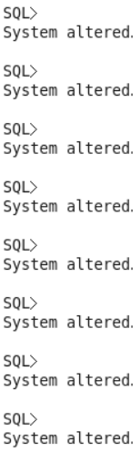

  6. 编辑主库及备份的/home/oracle/app/oracle/product/12.1.0/dbhome_1/network/admin/tnsnames.ora文件

     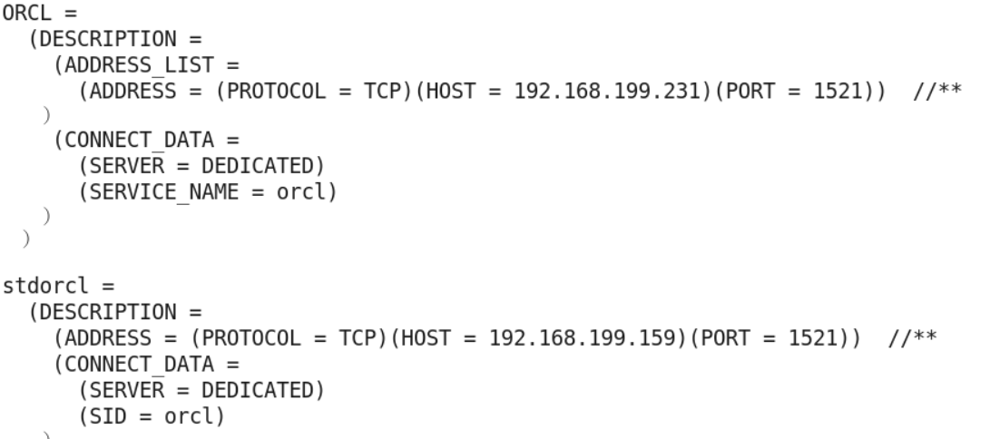

  7. 生成/home/oracle/app/oracle/product/12.1.0/dbhome_1/dbs/initorcl.ora

     

  8. 将主库的参数文件，密码文件拷贝到备库

     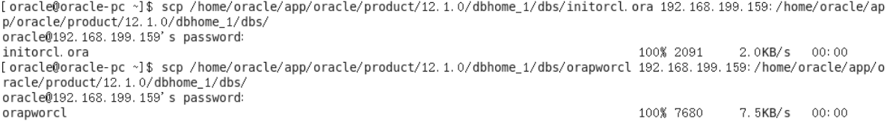

  9. 在备库上更改参数文件

     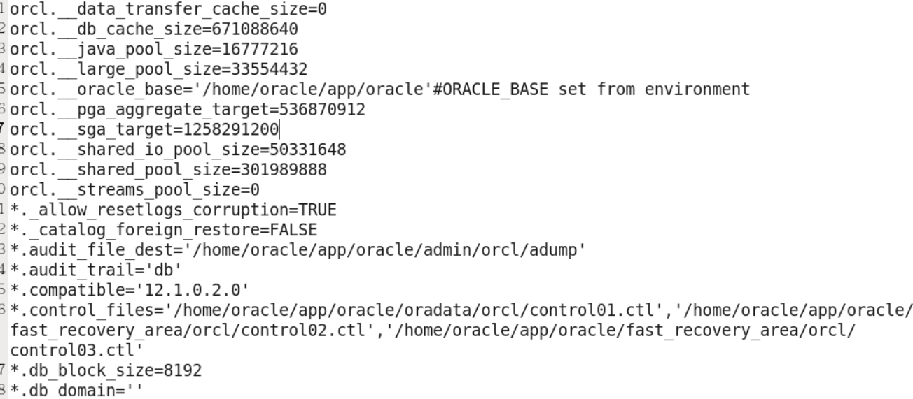

  10. 在备库增加静态监听

      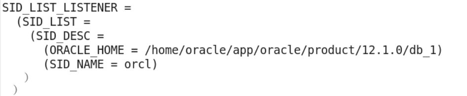

  11. 重新启动，备库开启实时应用模式

      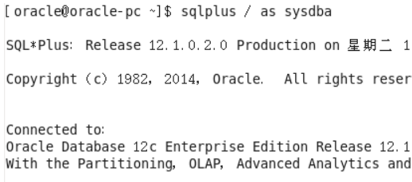

  

